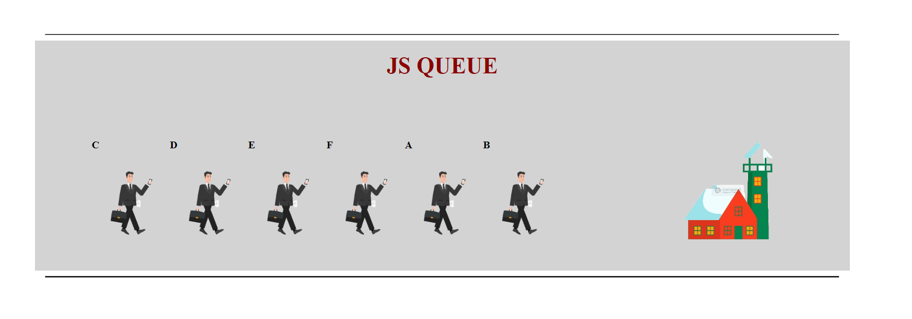

# JS-Practise-Cases

### Used Technologies - HTML,CSS and JavaScript

## This is Que Cases
### Case 01

#### Case 01 Sample Video
<a href="https://www.youtube.com/watch?v=FksJO93pDUs" target="_blank"> Example Video For Case 01 </a>

### Case 02

#### Case 02 Sample Video

<a href="https://www.youtube.com/watch?v=Im2AoGcvZRE" target="_blank"> Example Video For Case 02 </a>

## Case 03 - Knight Rider Circuit with sound

#### Sample Video

<a href="https://www.youtube.com/watch?v=oF0Mmrc3-p0&feature=youtu.be" target="_blank"> Example Video For Knight Rider Circuit </a>